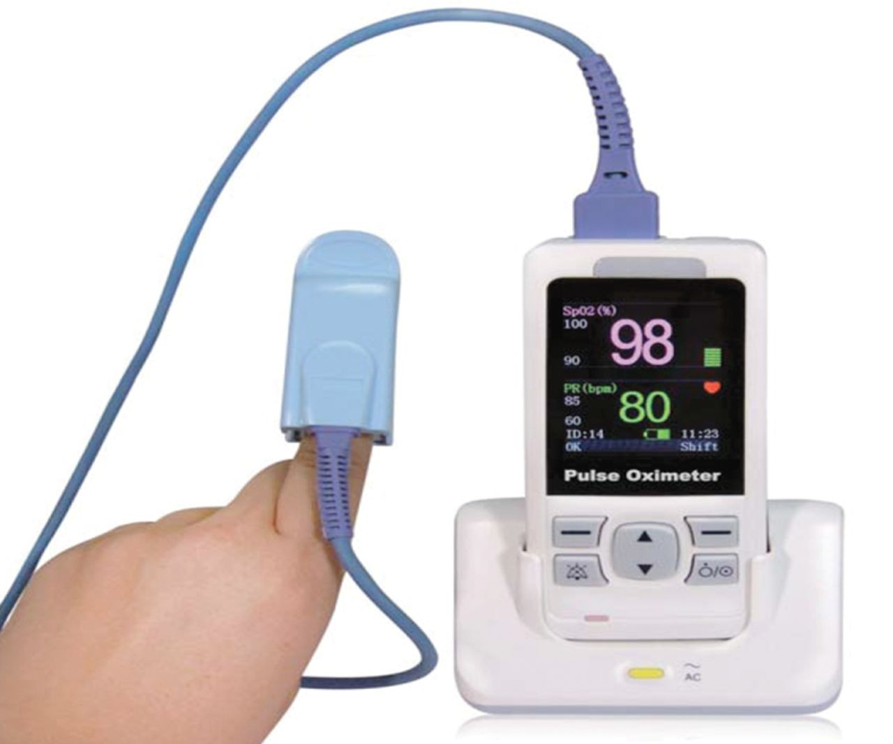
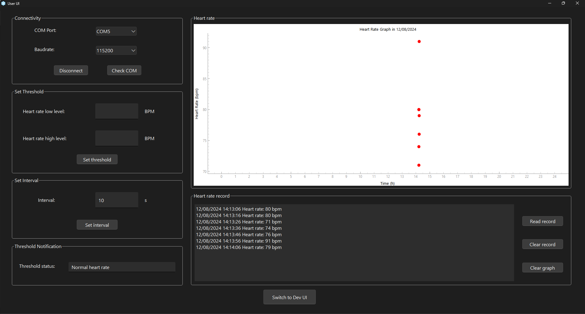

# PULSE OXIMETRY

 

  

# About Pulse Oximetry

PPG is the most commonly used measurement of heart rate for heart rate trackers. As your heart beats, the volume of blood changes within your cardiovascular systems, including the small skin vessels such as your veins and arteries. It is this change in volume which is recorded by the PPG sensor, via a small LED light.

# Table of Contents
- [PULSE OXIMETRY](#pulse-oximetry)
- [About Pulse Oximetry](#about-pulse-oximetry)
- [Table of Contents](#table-of-contents)
  - [1. Technologies](#1-technologies)
  - [2. Features](#2-features)
  - [3. Usages](#3-usages)

## 1. Technologies

  

* **Photoplethysmography (PPG) Sensor:** Convenient and fast measurement.
* **STM32-based**: The project is based on the STM32 microcontroller and its supported platform.
*  **Communication Protocols**: Includes many connectivies such as I2C, UART.
*  **Peripheral Libraries**: HAL-based firmware for this project.
*  **Graphic UI:** Build GUI applications by using PyQt5.

## 2. Features

About this Heart Rate Monitor:

1. **Real-time Heart Rate signal in OLED 0.92" screen:** Plot the real-time PPG signal and measure its characteristics such as heartbeat.

2. **Record the result:** User can record the Heart Rate result either by pushing the built-in button or setting interval through GUI.

3. **Turn on/off the device manually:** User can turn on/off the device by holding built-in button at least 3s.

## 3. Usages

There are many user scenarios, including education, sports or maker/interactive projects but should not be used to diagnose or treat medical conditions.

## 4. Demo
Pulse oximetry and OLED:

  

Heart rate record and graph:

  

Stream PPG signal on GUI:

  

