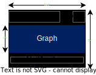
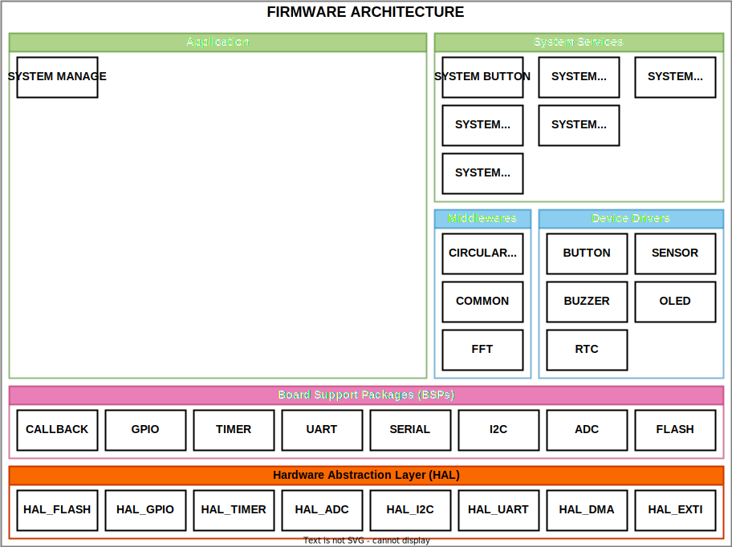

# PULSE OXIMETRY

# Table of Contents
- [PULSE OXIMETRY](#pulse-oximetry)
- [Table of Contents](#table-of-contents)
  - [1. Requirements](#1-requirements)
  - [2. Design](#2-design)
    - [2.1. Requirements Approach](#21-requirements-approach)
    - [2.2. Required Modules](#22-required-modules)
    - [2.3. Detail Features](#23-detail-features)
      - [Stream the real-time Heart Rate with 0.92" OLED](#stream-the-real-time-heart-rate-with-092-oled)
      - [Visualize the Heart Rate record on GUI application](#visualize-the-heart-rate-record-on-gui-application)
      - [Record the Heart Rate manually or periodic](#record-the-heart-rate-manually-or-periodic)
      - [Notificate to user when the Heart Rate is lower or upper then threshold](#notificate-to-user-when-the-heart-rate-is-lower-or-upper-then-threshold)
      - [Easy to turn on/off device](#easy-to-turn-onoff-device)
    - [2.4. Block Diagram](#24-block-diagram)
    - [2.5. Firmware Architecture](#25-firmware-architecture)
  - [3. Contributors](#3-contributors)

## 1. Requirements

* Measure the Heartbeat within an accuracy 10 percent of actual value.
* Stream the real-time PPG Heart Rate signal in OLED screen.
* Record the current Heart Rate by clicking the button.
* Record the Heart Rate per period by setting interval in GUI application.
* Store upto 1,000 Heart Rate records with format *hh:mm:ss - DD/MM/YY - heart rate result*.
* Detect the Hypertension and alert through buzzer.
* Set the alert threshold throught GUI application.
* Show the records on GUI.

## 2. Design

### 2.1. Requirements Approach

1. **Measure the Heartbeat within an accuracy 10 percent of actual value.**

- First, we filter the signal by ADC conversion with band-pass Butterworth filter.
- Second, we apply the TERMA framework and analysis the PPG signal. After that, we determine the peak of signal each period. 
- Then, we count the peaks in a short time, for example, in 2 second. We calculate the average time between peaks (called by $t_{avg}$) and estimate the heart rate by formula: $HR=60/t_{avg}$.

1. **Stream the real-time PPG Heart Rate signal in OLED screen.**
- The problem is real-time display. Heart Rate PPG signal have the frequency in range $0.5 - 5Hz$ (with Heart Rate from 30 to 300 bpm). So that, the refesh rate of display should be $5Hz$ minimum - 200ms per frame. We also consider the bandwidth of I2C interface (in this case is $400kHz$) and the frame data. We only refresh the area of display that have a real-time graph. 

1. **Record the current Heart Rate by clicking the button.**

- By the time user click the button, device will get the current Heart Rate value and store it in EEPROM of RTC module with timestamp.

4. **Record the Heart Rate per interval that set in GUI application.**

- In some case, we need to monitor Heart Rate for a long time. User can set the period to record the Heart Rate, and show the graph in GUI. How to store records can be mentioned below.

1. **Store Heart Rate records with format *hh:mm:ss - DD/MM/YY - heart rate result*.**

- Above format takes 32bit of space. The device has the embedded memory up to 512 KB but we just use 64 KB for records storage (equivalent to 4 Sector from sector 0 to sector 3). So that, device can store over 16,000 records.

1. **Detect the Hypertension and alert through buzzer.**
- Device can do that if user enter the upper threshold and lower threshold of the Heart Rate.

1. **Set the alert threshold throught GUI application.**
- User set the upper and lower Heart Rate by this way. GUI will transmit that value to device and it will monitor and compare the Heart Rate.

1. **Show the records on GUI.**
- We use Qt Designer for Python to design the GUI. After receive the records to device, GUI will copy those data to .txt or .csv file and display records on a graph.

### 2.2. Required Modules

* STM32F411VET6 Discovery Kit
* SSD1306 I2C OLED
* DS1307 RTC Module
* [Analog/Digital PPG Heart Rate Sensor](https://hshop.vn/products/cam-bien-nhip-tim-dfrobot-gravity-analog-digital-ppg-heart-rate-sensor)
* USB to TTL CP2102 

### 2.3. Detail Features

#### Stream the real-time Heart Rate with 0.92" OLED
 

  

#### Visualize the Heart Rate record on GUI application
 

  

#### Record the Heart Rate manually or periodic
- Click the button to record the Heart Rate immediately.
- Set interval of each record. Minimum: 10 seconds.

#### Notificate to user when the Heart Rate is lower or upper then threshold
- The thresholds can be set on GUI application.
- Change the color of the heart icon at the up-right corner.
- Turn on the buzzer with sound "beep beep".

#### Easy to turn on/off device
- User just hold the build-in button in 3s.

### 2.4. Block Diagram

 

  

### 2.5. Firmware Architecture

 

  

## 3. Contributors
1. Viet Hoang Xuan
2. Giang Phan Truong
3. Khanh Nguyen Ngoc